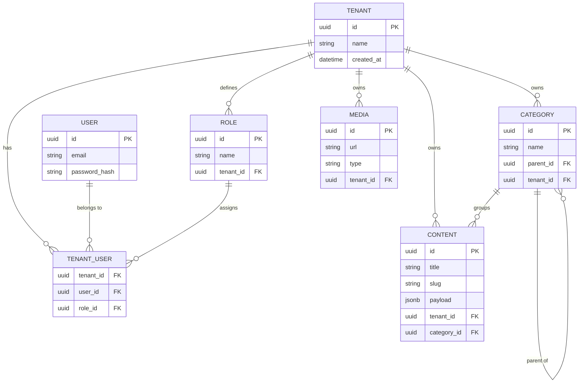

  
# 🗄️ Database Design
**Schema & Entity Relationships for Atlas Platform**

---

## 🏗️ 1. Architecture Overview

Atlas Platform utilizes a robust relational database model powered by **PostgreSQL**, managed via **Prisma ORM**.
The design enforces strict foreign key constraints, indexes for high-performance querying, and a robust multi-tenant architecture utilizing a shared database with `tenant_id` isolation.

## 🗃️ 2. Core Entities

### 🏢 Tenant Management

| Table          | Description                                                                                     |
| :------------- | :---------------------------------------------------------------------------------------------- |
| `Tenant`       | The root entity for isolation. Every domain, setting, and piece of content is tied to a tenant. |
| `TenantDomain` | Maps custom domains to specific tenants.                                                        |

### 🔐 Users & Access Control (RBAC)

| Table        | Description                                                           |
| :----------- | :-------------------------------------------------------------------- |
| `User`       | Global users across the platform.                                     |
| `Role`       | Roles (e.g., Admin, Editor, Viewer). Scoped per tenant.               |
| `TenantUser` | Junction table mapping a `User` to a `Tenant` with a specific `Role`. |

### 📝 Headless CMS Engine

| Table      | Description                                                                                                               |
| :--------- | :------------------------------------------------------------------------------------------------------------------------ |
| `Category` | Hierarchical structure for organizing content (supports parent-child relationships).                                      |
| `Content`  | The main entity representing an article, page, or custom entry. Contains a JSONB `payload` field for flexible structures. |
| `Media`    | Represents uploaded assets (images, documents, videos).                                                                   |

---

## 📊 3. Entity-Relationship Diagram (ERD)

---

## 💡 4. Key Design Decisions

1. **Shared Database Multi-Tenancy:** We use a single PostgreSQL database instance to keep costs low and migrations simple. Every table (except `User`) has a `tenant_id` foreign key.
2. **JSONB for Content Payload:** To allow flexible headless CMS structures without altering the schema, the `Content` table uses a native PostgreSQL `JSONB` column.
3. **Soft Deletes:** Critical tables implement a `deleted_at` timestamp to ensure data recovery and auditability.
4. **Prisma Middleware:** Prisma extensions will automatically append `where: { tenant_id: currentTenant }` to ensure strict tenant data isolation at the ORM level.
