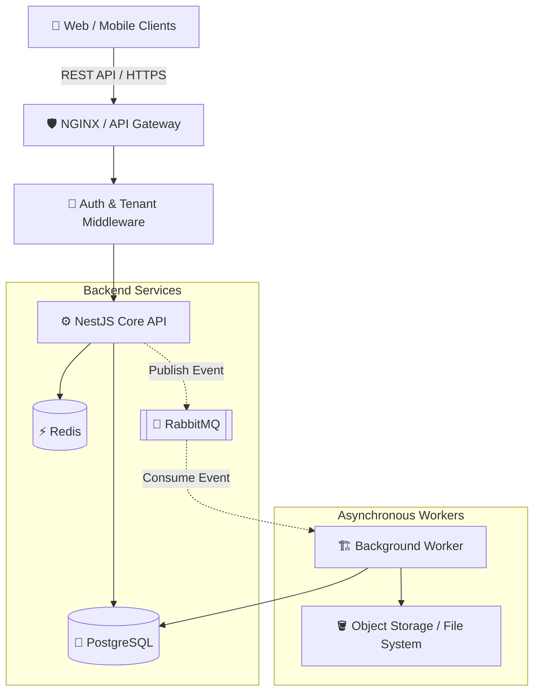

  
# 📐 Solution Design
**Architecture & System Components for Atlas Platform**

---

## 🏛️ 1. High-Level Architecture

The Atlas Platform is designed as a modular monolith running on **NestJS**. It is built for scale, incorporating asynchronous processing and heavy caching to maintain high throughput even under load.

---

## 🧩 2. Core Components Breakdown

### 🛡️ API & Security Layer

- **Tenant Resolver:** Intercepts every incoming request, extracting the `X-Tenant-ID` header or parsing the subdomain to inject the tenant context into the request lifecycle.
- **JWT Strategy:** Validates access tokens and issues refresh tokens.
- **RBAC Guard:** Ensures the authenticated user holds the required permissions for the requested resource within their current tenant context.
- **Validation Pipeline:** Enforces robust DTO validation across all incoming payloads using `class-validator` and `class-transformer`. Invalid requests are instantly rejected, and unified error responses are mapped by a global exception filter.

### 📝 Headless CMS Modules

- **Content & Categories:** Supports robust hierarchical content management with publishing workflows (Draft/Published).
- **Media Management:** Handles file uploads and asset delivery securely within the tenant boundary.
- **Search & Pagination:** Optimized database querying enabling high-performance listing, filtering, and pagination over large tenant datasets.

### ⚡ Caching Strategy (Redis)

- **Read-Heavy Endpoints:** CMS API read operations (e.g., fetching published content) are cached aggressively.
- **Cache Invalidation:** Updating or deleting content triggers a cache purge event for that specific item's key.

### ⚙️ Asynchronous Processing (RabbitMQ)

- **Decoupling Heavy Tasks:** Operations like generating a ZIP export of all tenant media or bulk-importing content are offloaded to RabbitMQ.
- **Job Tracking:** The worker updates the job status in Redis, allowing the frontend to poll for progress using a lightweight endpoint.

---

## 🚀 3. Infrastructure & Deployment

We utilize a containerized approach to guarantee consistency across development, staging, and production environments.

### 🐳 Docker Services

| Container      | Role                                                                 |
| :------------- | :------------------------------------------------------------------- |
| `atlas-api`    | The main NestJS application.                                         |
| `atlas-worker` | A separate NestJS instance dedicated purely to RabbitMQ consumption. |
| `postgres`     | Primary relational data store.                                       |
| `redis`        | In-memory cache and job status tracker.                              |
| `rabbitmq`     | Message broker for microservice communication.                       |

### 🔄 CI/CD Pipeline

1. **Lint & Test:** GitHub Actions automatically runs ESLint, Prettier, and Jest unit tests on every Pull Request.
2. **Build:** On merge to `main`, Docker images are built and pushed to the container registry.
3. **Deploy:** Webhooks trigger the staging/production servers to pull the latest images and perform a rolling update with zero downtime.

---

> **Design Philosophy:** Keep it simple, but build it to scale. The modular monolith approach allows us to move fast now, while the bounded contexts (Tenant, Auth, CMS, Media) prepare us for a seamless transition to microservices in v2.0.
